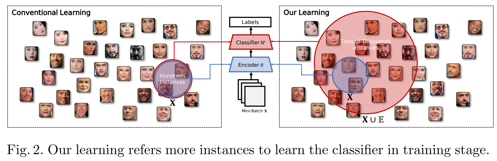

# BroadFace: Looking at Tens of Thousands of People at Once for Face Recognition

Official PyTorch implementation of BroadFace: Looking at Tens of Thousands of People at Once for Face Recognition ([https://arxiv.org/abs/2008.06674](https://arxiv.org/abs/2008.06674)), ECCV 2020

This repository contains source codes of experiments for image retrieval (deep metric learning).

---
<p align="center">
  
</p>

## Dependencies

You need a `CUDA-enabled GPU` and `python` (>3.6) to run the source code.

- torchvision >= 0.4.2
- torch >= 1.1.0
- tqdm
- scipy
- Pillow


```
pip install -r requirements.txt
```

## Preparing datasets
### 1. Make `dataset` directory 
```
mkdir ./dataset
```
### 2. (Optional) Only for In-Shop Clothes Retrieval
The source code will automatically download CUB-200-2011, Cars-196, and Stanford Online Products datasets.


But you need to manually download In-Shop Clothes Retrieval dataset.


1. Make `Inshop` directory in `./dataset` directory
```
mkdir -p ./dataset/Inshop
```
2. Download `img.zip` at the following link, and unzip it in `Inshop` directory
```
https://drive.google.com/drive/folders/0B7EVK8r0v71pYkd5TzBiclMzR00
```
3. Download  `list_eval_partition.txt` at the following link, and put it in the `Inshop` directory.
```
https://drive.google.com/drive/folders/0B7EVK8r0v71pWVBJelFmMW5EWnM
```


## Quick start
```bash
# Stanford Online Products
### ArcFace
python run_stanford.py --loss arcface

### BroadFace (without Compensation)
python run_stanford.py --loss broadface --queue-size 32000

### BroadFace (with Compensation)
python run_stanford.py --loss broadface --queue-size 32000 --compensate


# In-Shop Clothes Retrieval
### ArcFace
python run_inshop.py --loss arcface

### BroadFace (without Compensation)
python run_inshop.py --loss broadface --queue-size 32000

### BroadFace (with Compensation)
python run_inshop.py --loss broadface --queue-size 32000 --compensate
```


## Citation

In case of using this source code for your research, please cite our paper.

```
@inproceedings{kim2020broadface,
  title={BroadFace: Looking at Tens of Thousands of People at Once for Face Recognition},
  author={Kim, Yonghyun and Park, Wonpyo and Shin, Jongju},
  booktitle={European Conference on Computer Vision},
  pages={536--552},
  year={2020},
  organization={Springer}
}
```